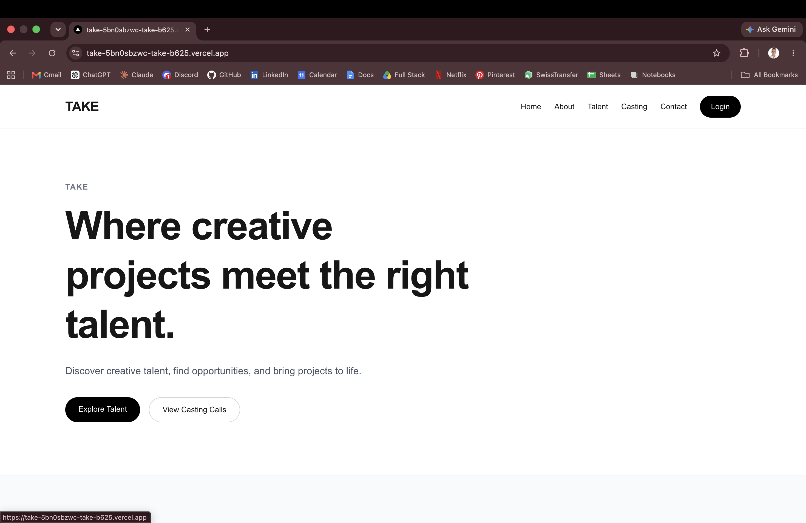
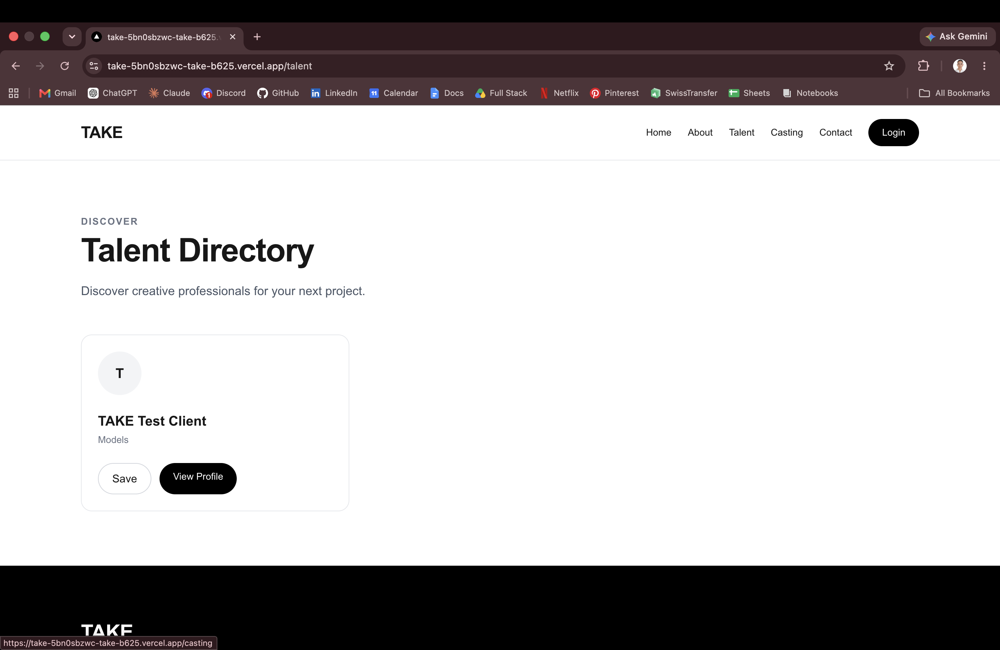
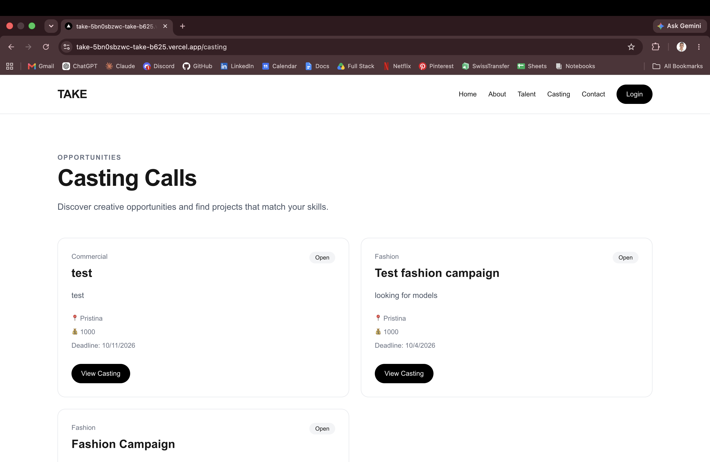
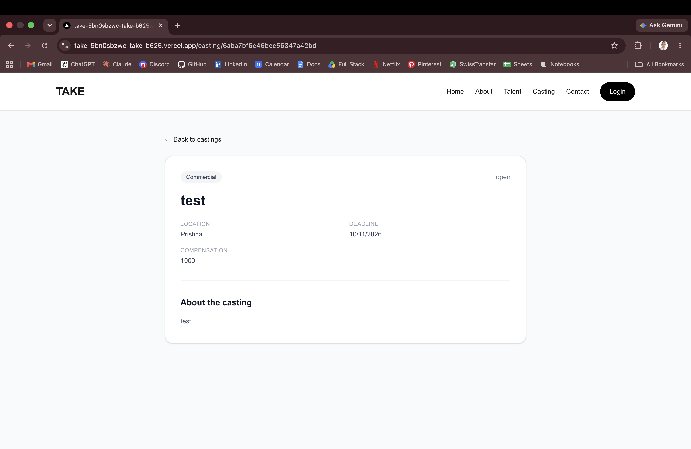
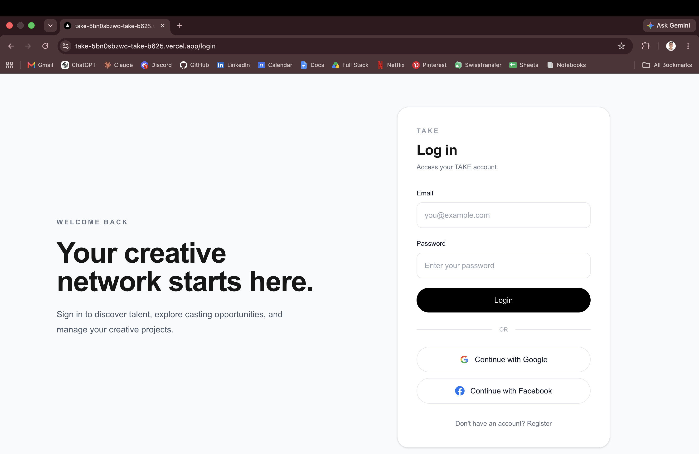
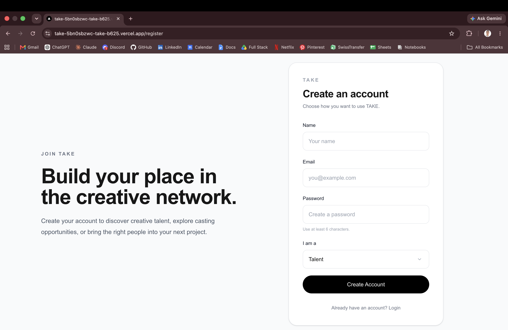
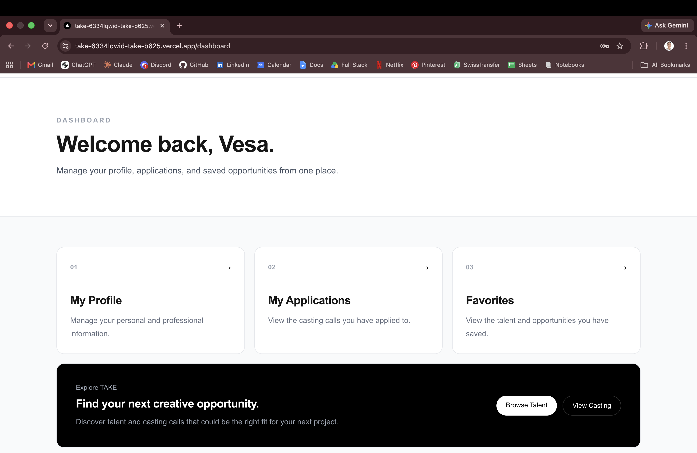

# TAKE — Creative Production & Casting Platform

TAKE is a creative production and casting platform designed to connect clients and production teams with creative talent.

The platform allows users to discover talent, explore casting opportunities, create and manage profiles, save favorites, submit applications, and manage casting calls.

## Live Demo

**https://take-amber.vercel.app/**

## Project Overview

TAKE was developed as an individual university project for the course **Client-Side Web Development**.

The platform focuses on simplifying the process of discovering creative professionals and connecting them with production opportunities.

### User Roles

* **Talent** — creates a profile, showcases skills and experience, discovers casting calls, and applies for opportunities.
* **Client** — creates casting calls and manages opportunities.
* **Admin** — manages platform content and has access to protected administrative functionality.

## Main Features

* User registration and login
* Email and password authentication
* Google authentication
* Facebook authentication
* Role-based access control
* Protected routes
* Talent directory
* Talent profiles
* Casting call listings
* Dynamic casting detail pages
* Create casting calls
* Talent profile management
* Favorites
* Applications
* Contact form with database storage
* Admin dashboard
* CRUD operations for talent and casting calls
* Responsive user interface
* MongoDB database integration
* Server-side rendering
* Static generation
* Incremental Static Regeneration

## Pages

* Home
* About
* Contact
* Login
* Register
* Talent Directory
* Talent Profile
* Casting Calls
* Casting Details
* Create Casting
* Favorites
* Applications
* Dashboard
* Profile
* Admin

## Technologies

### Frontend

* Next.js 16
* React 19
* TypeScript
* Tailwind CSS
* React Hook Form

### Backend

* Next.js API Routes
* Node.js
* MongoDB
* Mongoose

### Authentication

* NextAuth.js
* Credentials Provider
* Google OAuth
* Facebook OAuth
* JWT-based sessions
* Role-based authorization

### Testing

* Jest
* React Testing Library
* node-mocks-http

### Deployment

* Vercel
* MongoDB Atlas

## Database Models

The application uses MongoDB with the following main models:

* **User**
* **Talent**
* **CastingCall**
* **Application**
* **ContactMessage**

## CRUD Functionality

TAKE implements CRUD functionality for two main entities.

### Talent

* Create talent profile
* Read talent profiles
* Update talent profile
* Delete talent profile

### Casting Calls

* Create casting call
* Read casting calls
* Update casting call
* Delete casting call

## Authentication & Authorization

Authentication is handled using **NextAuth.js**.

The application supports:

* Email and password authentication
* Google authentication
* Facebook authentication
* JWT-based sessions
* User roles
* Protected routes
* Admin-only access

Protected areas include:

* Dashboard
* Profile
* Applications
* Favorites
* Create Casting
* Admin

## Rendering

TAKE demonstrates different Next.js rendering methods:

* **SSR** using `getServerSideProps`
* **SSG** using `getStaticProps`
* **Dynamic SSG** using `getStaticPaths`
* **ISR** using `revalidate`

Casting detail pages use dynamic static generation with Incremental Static Regeneration.

## Forms & Validation

The project uses **React Hook Form** for form handling and validation.

Functional forms include:

* Registration
* Login
* Contact
* Talent Profile
* Casting Creation

Forms include validation and user feedback for successful or unsuccessful submissions.

## State Management & Hooks

The project demonstrates:

* `useState`
* `useEffect`
* React Context API
* Custom React hooks

A custom `useFavorites()` hook is used to manage the favorites functionality.

## Testing

The project includes automated tests for reusable components and API routes.

### Component Tests

* TalentCard
* CastingCard
* Header

### API Tests

* Talent API
* Casting API

The complete test suite passes successfully.

## Installation

Clone the repository:

```bash
git clone https://github.com/grajqa/take.git
cd take
```

Install dependencies:

```bash
npm install
```

### Environment Variables

Create a `.env.local` file in the root of the project and add the required environment variables:

```env
MONGODB_URI=
NEXTAUTH_SECRET=
NEXTAUTH_URL=http://localhost:3000

GOOGLE_CLIENT_ID=
GOOGLE_CLIENT_SECRET=

FACEBOOK_CLIENT_ID=
FACEBOOK_CLIENT_SECRET=
```

> Do not commit `.env.local` or any secret values to the repository.

### Run the Development Server

```bash
npm run dev
```

Open the application in your browser:

```text
http://localhost:3000
```

## Production Build

Create a production build:

```bash
npm run build
```

Run the production build locally:

```bash
npm start
```

## Screenshots

### Home



### Talent Directory



### Casting Calls



### Casting Details



### Login



### Register



### Dashboard




## Deployment

The project is deployed using **Vercel** and connected to **MongoDB Atlas** for the production database.

### Live Application

**https://take-amber.vercel.app/**

## Project Author

**Vesa Grajçevci**

Individual Project — Client-Side Web Development

This project was developed as part of the university course **Client-Side Web Development**.
